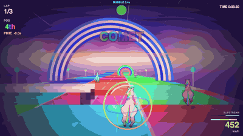

# Rainbow Gallop

A six-unicorn race down a rainbow road in the clouds, built for
**js13kGames 2026** (theme: *Unicorns and Rainbows*). The whole game, including
every sprite, sound effect and music track, fits in a single zipped HTML file
under 13,312 bytes. Nothing is loaded from the network and no library is used.

`js13k-game.zip` is the submission file, produced by `npm run build`. Unzip it
and open `index.html` in a browser, or open `src/index.html` directly to play the
readable source.



## Playing

Acceleration is automatic. There is no brake.

| | Desktop | Mobile |
|---|---|---|
| Steer | left / right arrows | tilt the device (buttons as fallback) |
| Jump | up arrow | JUMP |
| Fire | space | FIRE |

Three laps, five opponents. On the first touch, mobile asks for permission to
use the gyroscope; if you decline, on-screen arrows appear instead.

## The colour mechanic

The road is split into three longitudinal lanes, each with its own colour, and
the pattern shifts by one lane on every musical bar. Riding through a rainbow
arch repaints your unicorn, and every bot that passes under it too. Running on
a lane that matches your current colour makes you 8% faster. There is no penalty
for being on the wrong lane, so the mechanic rewards attention without punishing
players who ignore it.

Your matching lane pulses white and a coloured halo sits under your hooves, so
the line you want to hold is readable at speed.

Everything else on the track is placed on the same musical grid. One bar is 73
segments, which at top speed is 1.593 seconds against the music's 1.600, so
hurdles, rings and item boxes drift out of sync by only 7 milliseconds per bar.
Jumping within 11% of the beat builds a rhythm combo.

## Other mechanics

Slipstreaming charges while you sit in an opponent's wake and lifts your speed
ceiling by up to 14%, worth about 24% more average speed over a lap. Item boxes
give one of four pickups: a homing comet, a protective bubble, a jump boost, or
a triple straight shot. Clipping a hurdle at full height costs 38% of your
speed; clearing one cleanly gives a small boost.

The opponents do not use rubber-banding. Each one follows its own target gap
that slides from a start value to a finish value across the race, in the style
of the Pure and Black Rock racing games, which keeps finishes spread out instead
of bunching every bot on the player's bumper. They make the same mistakes you
can: roughly 28 visible errors and 10 position changes per race.

## Building

Requires Node.js (see `.nvmrc`), Python 3 and `zip`/`unzip`.
Install the pinned tools with `npm ci`. Install AdvanceCOMP (`advzip`) for the
smallest archive; without it the build may exceed the contest budget.

```sh
npm run build          # -> js13k-game.zip, dist/js13k/, dist/wavedash/
npm run build:best     # same, keeping the smallest of 8 roadroller draws
npm test               # track geometry, physics, a full race, rendering, edge cases
npm run wavedash       # the Wavedash integration, on the terser output
npm run check          # both test suites
```

`build.sh` extracts the script, runs it through terser, packs it with roadroller,
zips, recompresses the container with `advzip` when it is installed, and prints
the remaining budget. It takes the source path as its argument.

Two knobs, both environment variables:

- `RRBEST=n` runs roadroller `n` times and keeps the smallest output. Its
  parameter search is random. **The ZIP size varies between builds**; read
  the measured size printed by the current build.
- `RRSEL=n` sets the number of Roadroller contexts (default: 10).
  Fewer contexts decode faster but generally produce a larger archive.

Official outputs are replaced only after compression, archive integrity and
size checks succeed. Failed builds leave the previous outputs intact. Both
target directories are regenerated to prevent stale files entering an upload.

`FAST=1` skips roadroller entirely and writes to `dist/fast/`; it never touches
the zip or `dist/js13k/`.

## Wavedash

The game is also entered in the **Wavedash challenge**, which is a checkbox on
the same js13k entry, not a second submission. The platform injects a `Wavedash`
global before the game runs. The game calls `init()` and waits for
`requestStats()` before sending queued trophies. Every API call is guarded;
no SDK is bundled and the game also runs without Wavedash.

The ten trophy definitions are in [wavedash-achievements.json](wavedash-achievements.json).
Import this file in Developer Portal → Achievements → Add achievement → Import
JSON, then compare with `wavedash achievement list`. Definitions must exist on
the platform; the game cannot unlock an unknown identifier. On 2026-09-12 the
CLI reported no remote achievements; the JSON still needs importing.

Four leaderboards are created on race completion, then receive rounded scores
with `keepBest: true`:

| Name | Score | Order | Display |
|---|---|---|---|
| `race-v1` | Race duration | Ascending | Milliseconds |
| `lap-v1` | Best lap duration | Ascending | Milliseconds |
| `speed-v1` | Peak speed in km/h | Descending | Number |
| `combo-v1` | Best rhythm combo, including zero | Descending | Number |

`npm run wavedash` verifies source and Terser output with a strict SDK stub.
A signed-in race through `wavedash dev` is still needed to verify persistence
on Wavedash. The CLI cannot list leaderboards.

`wavedash.toml` points at `dist/wavedash/`, which holds the unminified page —
there is no size limit there, so no roadroller and no decode delay.

One build trap worth recording: `terser --compress booleans_as_integers=true`
rewrites `true` as `1`, and the Wavedash SDK validates its argument types, so
every call would be rejected in silence — working from source, broken from the
zip. That option is deliberately absent from `build.sh`.

## Layout

```
src/index.html           the game, readable and commented
build.sh                 the build chain
wavedash.toml            Wavedash deployment config
wavedash-achievements.json trophy definitions for portal import
js13k-game.zip           the submission archive (generated, not committed)
dist/js13k/index.html    compressed page, the one inside the zip (generated)
dist/wavedash/index.html unminified page for Wavedash (generated)
media/                   gameplay GIF, submission cover and thumbnail
tools/                   test harnesses, see tools/README.md
```

## Technical notes

The renderer is a pseudo-3D segment projector, not a raycaster: 1,484 road
segments are projected with a perspective divide, sorted back to front, and
drawn as trapezoids with billboarded sprites on top. A lap is 35.6 seconds at
top speed.

The unicorn is drawn procedurally into 96 pre-rendered canvases (six coat
colours by two gaits by eight animation phases), with the outline produced by
dilating the silhouette. Two gaits are used, a floating canter at low speed and
a gathered bound at high speed, with hysteresis at 0.55 and 0.42 to stop the
animation flickering between them.

The music is a NES-style engine: two pulse channels, a triangle bass and a noise
channel, with a swing feel from delaying weak sixteenths by 32 ms. It runs a
16-bar loop in two contrasting sections and modulates up two semitones with a
faster tempo on the final lap.

If the frame rate drops below 38, the renderer drops bloom first, then reduces
draw distance in steps down to 90 segments.

## Wavedash video

`media/wavedash-gameplay.mp4` is a generated 1280×720 H.264 clip with ten
seconds of opening gameplay, without the countdown. It is silent. The video
and intermediate frames are kept locally, outside Git and the game upload.

With the `js13k-finalize` capture harness, Playwright Chromium and ffmpeg:

```sh
python3 "$HOME/.codex/skills/js13k-finalize/scripts/record-gif.py" \
  --video --fps 30 --secs 14 --from 109 --take 300 \
  --driver tools/drive-gif.js --out media/wavedash-gameplay.mp4
```
